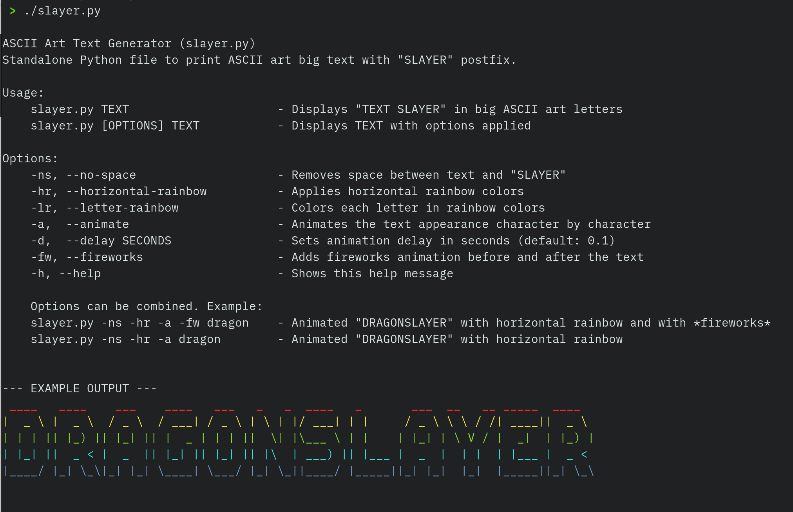

# ASCII Art Slayer

A standalone Python script that generates ASCII art text with a "SLAYER" postfix.

## Screenshots



## Features

- **ASCII Art Text**: Transforms input text into large ASCII art letters
- **"SLAYER" Postfix**: Automatically adds "SLAYER" to your text (e.g., "DRAGON" → "DRAGONSLAYER")
- **Rainbow Colors**: Choose between horizontal or letter-by-letter rainbow coloring
- **Animation**: Watch text appear character by character with adjustable speed
- **Fireworks**: Create a spectacular display with animated fireworks before and after your text

## Requirements

- Python 3.x
- No external dependencies - completely standalone!

## Installation

Download the script:
   ```
   git clone https://github.com/tomcoolpxl/slayer.git
   ```

## Usage

Basic usage:
```
./slayer.py TEXT
```

With options:
```
./slayer.py [OPTIONS] TEXT
```

### Options

| Option | Long Form | Description |
|--------|-----------|-------------|
| `-ns` | `--no-space` | Removes space between text and "SLAYER" |
| `-hr` | `--horizontal-rainbow` | Applies horizontal rainbow colors (each row different color) |
| `-lr` | `--letter-rainbow` | Colors each letter in a different rainbow color |
| `-a` | `--animate` | Animates the text appearing character by character |
| `-d SECONDS` | `--delay SECONDS` | Sets animation delay in seconds (default: 0.1) |
| `-fw` | `--fireworks` | Adds fireworks animation before and after the text |
| `-h` | `--help` | Shows usage information and an example |

### Examples

Display "DRAGON SLAYER" in big ASCII art letters:
```
./slayer.py dragon
```

Display "DRAGONSLAYER" with no space and horizontal rainbow colors:
```
./slayer.py -ns -hr dragon
```

Combine options for maximum effect:
```
./slayer.py -ns -hr -a -fw dragon
```

Spectacular fireworks display with "SOCKSLAYER":
```
./slayer.py -ns -hr -a -fw sock
```

## How It Works

The script includes a built-in ASCII art font, but completely embedded within the script itself - no external dependencies required. It transforms each character of your input text into ASCII art and adds special effects based on your chosen options.

## License

This project is licensed under the MIT License - see the LICENSE file for details.